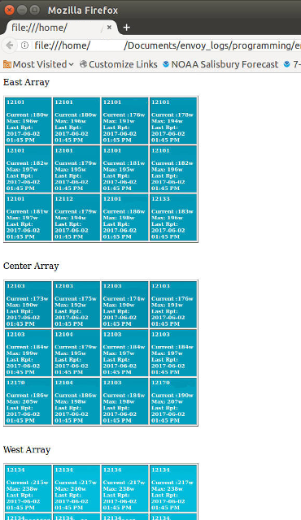

# Enphase-Envoy-S-Panel-Production
Python v3 script to retrieve Enphase Envoy-S Solar Inverter Per-Panel Production

Please note that this script is NOT a product of Enphase Energy. If it doesn't work, please contact me, not Enphase. Enphase Energy is a company which primarily manufactures microinverters for solar PV arrays. Enphase Energy has an API for their Enlighten monitoring service. Enphase Enlighten (TM) provides access to current and historical solar production data and status informaton. Most of the power production information provided by this script is available through Enphase Enlighten via the Web, it just takes longer to retrieve.

The purpose of this script is to demonstrate the retrievial of per-panel (inverter) information locally without traversing the Internet, or the need for the Enphase installer toolkit.
Please note that the array layout is unique to my site.  Different solar installations will have different panel layouts.  This script writes out the solar production information into three plain html tables - one for each of my top of pole mounts.  A Python list is initialized at the top of the program that relates each panel serial number (redacted) to it's location in one of the three html tables.  

The script changes the background color of each table cell using RGB() color values to approximate the amount of power being produced.

This Python script was created to run on Python 3.5 on most operating systems.
It has been tested on Pythonista version 3 on the iPad as well.

The script writes out a plain HTML file named: envoy-production.html , then opens that html in the local Web browser.

A sample of the script output follows:

